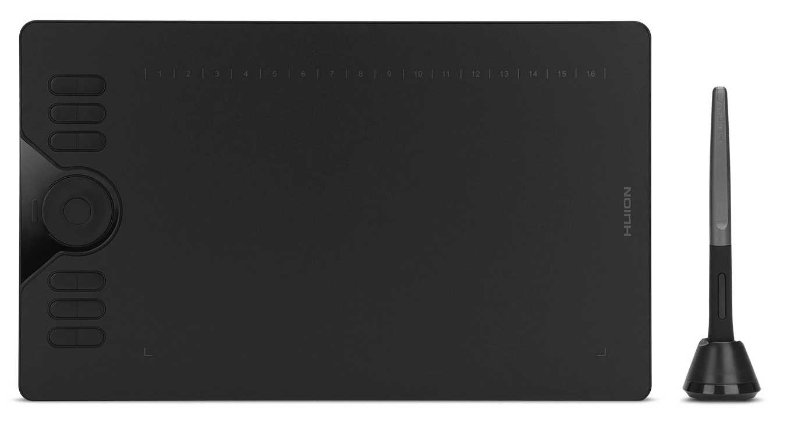
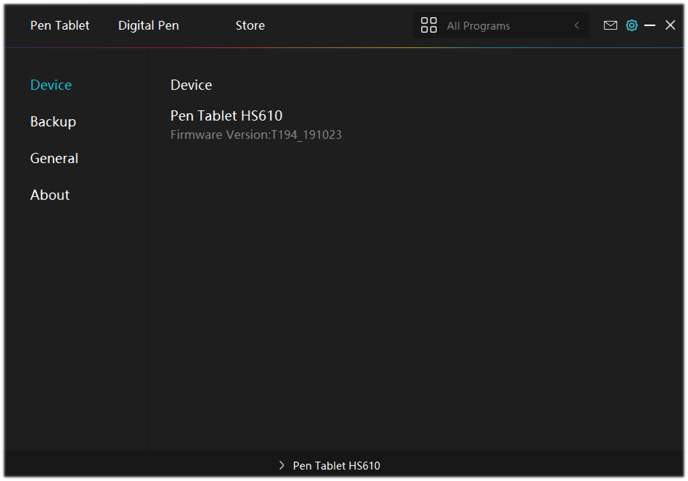
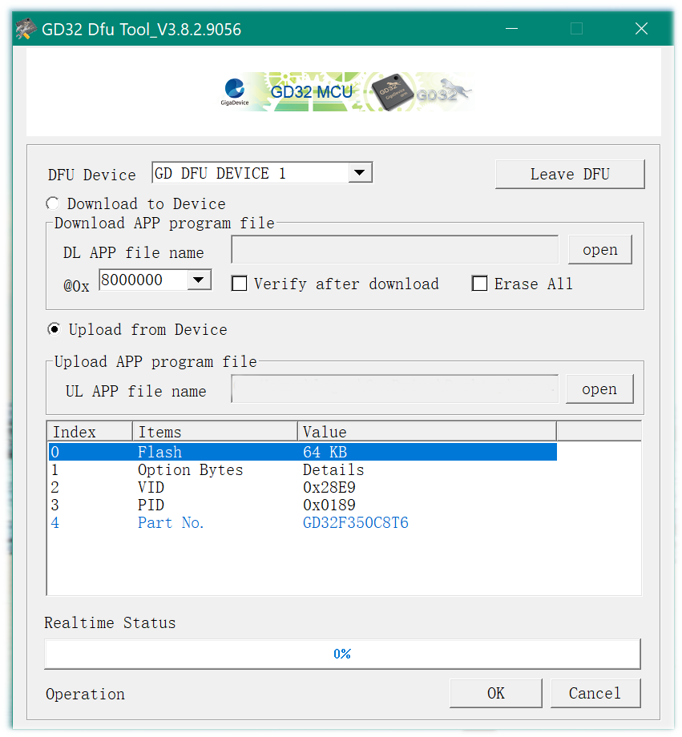
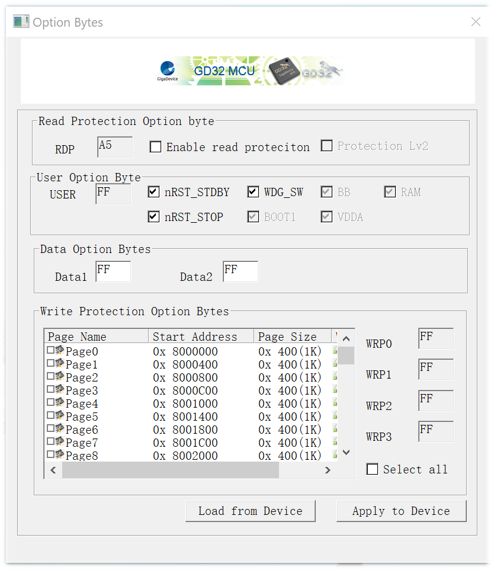
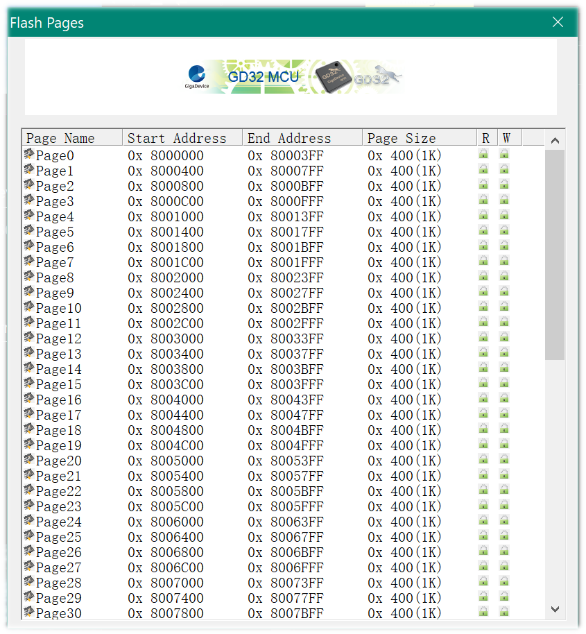
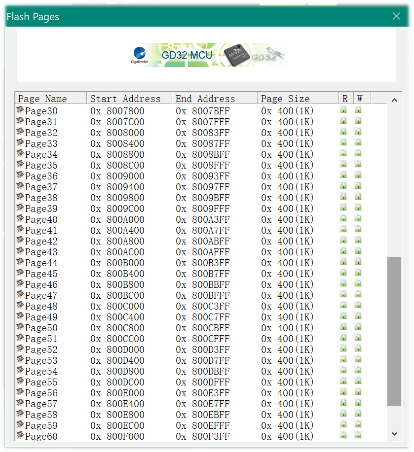
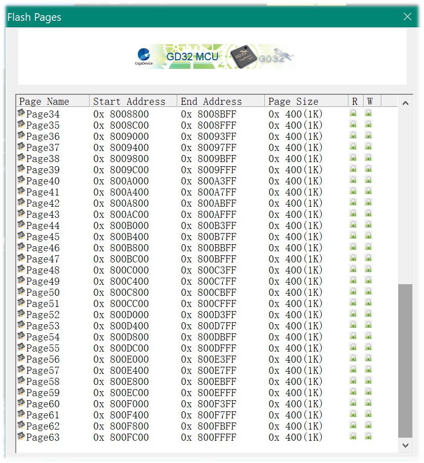

# HS610



I have this tablet to learn to draw with, but it is currently unusable as the drivers do not work. So, in the process of learning what I need to re Linux USB HID drivers, this repo contains the information I have discovered about this device.

## USB ID on Linux

```bash
$ lsusb|grep -i huion
Bus 001 Device 065: ID 256c:006d HUION Huion Tablet_HS610
```

## Flashing the firmware on Windows

On flashing the device under a Windows VM, you are prompted to press buttons 1 and 5 on the device as you plug it in, this puts the device into a new mode for flashing.

I flashed to the latest version, it all seemed a bit weird the way it worked, but the following is the version I have, I don't know if it's the same as it was before, as according to the HUION website.



### USB ID's

This prompted me to do the same on Linux and see what lsusb produced, interestingly, it gave the following:

```bash
$ lsusb
Bus 001 Device 041: ID 28e9:0189 GDMicroelectronics GD32 DFU Bootloader (Longan Nano)
```

The output of dmesg shows this on adding the device in flash mode:

```bash
[  +4.934932] usb 1-4.4: USB disconnect, device number 45
[  +4.517608] usb 1-4.4: new full-speed USB device number 46 using ehci-pci
[  +0.292254] usb 1-4.4: New USB device found, idVendor=28e9, idProduct=0189, bcdDevice= 1.00
[  +0.000006] usb 1-4.4: New USB device strings: Mfr=1, Product=2, SerialNumber=3
[  +0.000002] usb 1-4.4: Product: GD32 USB DFU in FS Mode
[  +0.000002] usb 1-4.4: Manufacturer: GigaDevice
[  +0.000001] usb 1-4.4: SerialNumber: 䌵䜸
```

If you cannot read the SerialNumber, that's because they are CJK characters, I don't know what that translates to, Google was useless here.

I don't know what it means by FS mode, unless it means the extensions added by ST Micro-Electronics in DfuSe?

```bash
# lsusb -v -d 28e9:0189

Bus 001 Device 048: ID 28e9:0189 GDMicroelectronics GD32 DFU Bootloader (Longan Nano)
Device Descriptor:
  bLength                18
  bDescriptorType         1
  bcdUSB               2.00
  bDeviceClass            0
  bDeviceSubClass         0
  bDeviceProtocol         0
  bMaxPacketSize0        64
  idVendor           0x28e9 GDMicroelectronics
  idProduct          0x0189 GD32 DFU Bootloader (Longan Nano)
  bcdDevice            1.00
  iManufacturer           1 GigaDevice
  iProduct                2 GD32 USB DFU in FS Mode
  iSerial                 3 䌵䜸
  bNumConfigurations      1
  Configuration Descriptor:
    bLength                 9
    bDescriptorType         2
    wTotalLength       0x001b
    bNumInterfaces          1
    bConfigurationValue     1
    iConfiguration          0
    bmAttributes         0x80
      (Bus Powered)
    MaxPower              100mA
    Interface Descriptor:
      bLength                 9
      bDescriptorType         4
      bInterfaceNumber        0
      bAlternateSetting       0
      bNumEndpoints           0
      bInterfaceClass       254 Application Specific Interface
      bInterfaceSubClass      1 Device Firmware Update
      bInterfaceProtocol      2
      iInterface              0
      Device Firmware Upgrade Interface Descriptor:
        bLength                             9
        bDescriptorType                    33
        bmAttributes                       11
          Will Detach
          Manifestation Intolerant
          Upload Supported
          Download Supported
        wDetachTimeout                    255 milliseconds
        wTransferSize                    2048 bytes
        bcdDFUVersion                   1.1a
can't get device qualifier: Resource temporarily unavailable
can't get debug descriptor: Resource temporarily unavailable
Device Status:     0x0002
  (Bus Powered)
  Remote Wakeup Enabled
```

The USB descriptor above shows the DFU version to be 1.1a, which matches that of the DfuSe, as there is no USB DFU 1.1a document that I can find.

### DFU-Util

As I now know the chip in use her, this sent me looking for information on it, there are many by this company and I originally thought it was a RISC-V, as the dfu-util from [gd32-utils](https://github.com/riscv-mcu/gd32-dfu-utils) shows:

```bash
$ ~/opt/gd32-dfu-utils/bin/dfu-util -l
dfu-util 0.9

Copyright 2005-2009 Weston Schmidt, Harald Welte and OpenMoko Inc.
Copyright 2010-2016 Tormod Volden and Stefan Schmidt
This program is Free Software and has ABSOLUTELY NO WARRANTY
Please report bugs to http://sourceforge.net/p/dfu-util/tickets/

Found Runtime: [0a5c:21e8] ver=0112, devnum=18, cfg=1, intf=3, path="1-2.3", alt=0, name="UNKNOWN", serial="5CF37093A853"
Found DFU: [28e9:0189] ver=0100, devnum=43, cfg=1, intf=0, path="1-4.4", alt=0, name="UNKNOWN", serial="5C8GNGN"
Found Runtime: [1235:800a] ver=0125, devnum=2, cfg=1, intf=5, path="8-1", alt=0, name="Scarlett 2i4 USB-DFU", serial="UNKNOWN"
Found Runtime: [1235:800a] ver=0125, devnum=2, cfg=1, intf=5, path="8-1", alt=0, name="Scarlett 2i4 USB-DFU", serial="UNKNOWN"
```

The other two devices were also interesting to find, the last two devices are the same just listed twice, again for some unknown reason.

There are multiple versions of this tool, not one of them can download the firmware from the device as can be seen here:

```bash
 ~/opt/gd32-dfu-utils/bin/dfu-util -a 0 -v -U fw.dfu -d 256c:006d
dfu-util 0.9

Copyright 2005-2009 Weston Schmidt, Harald Welte and OpenMoko Inc.
Copyright 2010-2016 Tormod Volden and Stefan Schmidt
This program is Free Software and has ABSOLUTELY NO WARRANTY
Please report bugs to http://sourceforge.net/p/dfu-util/tickets/

Opening DFU capable USB device...
ID 28e9:0189
Run-time device DFU version 011a
Claiming USB DFU Interface...
Setting Alternate Setting #0 ...
dfu-util: Cannot set alternate interface
```

## GD32 DFU Tool

This led to a bit of searching and I managed to grab the tool shown [here](https://github.com/riscv-mcu/gd32-dfu-utils/issues/2) and run it on Windows:







As can be see by the first window, gives us the MCU part number, [GD32F350C8T6](https://www.gigadevice.com/microcontroller/gd32f350c8t6/)

* [DataSheet](./docs/GD32F350xx_Datasheet_Rev1.4.pdf)
* [User Manual](./docs/GD32F3x0_User_Manual_EN_v2.1.pdf)
* [Firmware Library User Guide](./docs/GD32F3x0_Firmware_Library_User_Guide_Rev1.0.pdf)
* [GD32 DFU Tool and DFU Drivers](http://www.gd32mcu.com/en/download?kw=dfu&lan=en)
